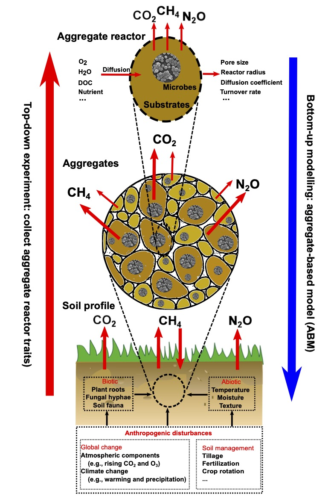

# ABM
Aggregate-based model (ABM) of soil systems comprising soil aggregates as biogeochemical reactors of different sizes.

  

  

## Conceptual basis

Wang, B., Brewer, P. E., Shugart, H. H., Lerdau, M. T., & Allison, S. D. (2019). [Building bottom-up aggregate-based models (ABMs) in soil systems with a view of aggregates as biogeochemical reactors](https://doi.org/10.1111/gcb.14684). Global Change Biology, 25(8), e6-e8.

Wang, B., Brewer, P. E., Shugart, H. H., Lerdau, M. T., & Allison, S. D. (2019). [Soil aggregates as biogeochemical reactors and implications for soil–atmosphere exchange of greenhouse gases—A concept](https://doi.org/10.1111/gcb.14515). Global Change Biology, 25, 373-385.
